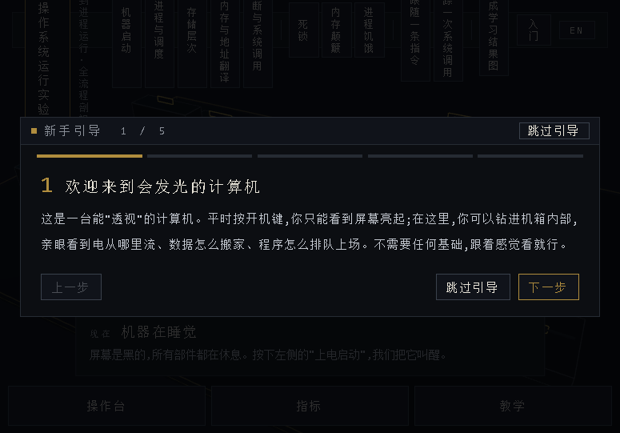

# 立体课本 - 操作系统运行实验台

从按下电源到进程运行的全流程 3D 互动教学网站。纯程序化几何体(无外部模型/贴图/图片/视频/音频),由一套确定性离散事件模拟内核统一驱动粒子、指标、图表与硬件 3D 状态。

🔗 **在线演示**：<https://aizenhi.github.io/os-lab/> —— 打开即玩，无需安装。



> `docs/` 目录为构建产物，供 GitHub Pages 在线演示；源码在根目录，`npm run build` 后将 `dist/` 内容同步到 `docs/` 即可更新演示。

## 快速开始

```bash
npm install
npm run dev        # 开发服务器
npm test           # 66 项单元测试(vitest)
npm run build      # tsc --noEmit + vite build(零错误)
npm run preview    # 预览构建产物
```

## 双击快捷方式启动

桌面上的 **"立体课本 - 操作系统运行实验台"** 快捷方式即可一键打开(首次使用请先 `npm run build` 生成 `dist/`):

- 双击后自动启动零依赖本地静态服务器(`serve.mjs`,端口 4310)并用默认浏览器打开
- 服务器已运行时再次双击不会重复启动,只聚焦打开浏览器页面
- 服务器窗口最小化在任务栏,关闭该窗口即停止服务器
- 手动启动等价于双击项目目录下的 `start-oslab.bat`(或 `node serve.mjs`)

> 不能直接双击 `dist/index.html`:`file://` 协议下浏览器的同源策略会拦截 ES 模块加载,必须经由本地 HTTP 服务器提供页面。

快捷方式指向 `start-oslab.bat`,图标使用 `public/favicon.ico`(程序化生成)。若移动了项目目录,重新创建快捷方式即可(目标指向新的 bat 路径)。

## 技术栈

Vite · React 18 · TypeScript · Three.js · @react-three/fiber · @react-three/drei · Zustand · Web Audio API · Canvas API

## 模块结构

```
src/
  kernel/    确定性离散事件模拟内核
    sim.ts       整机状态机:流水线/缺页链/DMA/中断/调度/启停机序列
    isa.ts       精简指令集与确定性程序生成器(LW/SW/分支/SYS 等)
    cache.ts     直接映射缓存(写回+写分配),L1/L2/L3 层次
    mmu.ts       TLB(8 项 LRU)与两级页表
    scheduler.ts FCFS/SJF/RR/优先级调度 + 死锁检测(等待图找环)
    fs.ts        磁盘块分配与 inode
    rng.ts       mulberry32 固定种子随机
  state/     Zustand 中央状态管理(localStorage 持久化语言/进度)
  i18n/      中英双语文案(zh 为基准,en 类型约束键一致)
  audio/     Web Audio 程序化合成(风扇/流水线节拍/缺页/中断/警报)
  flow/      池化粒子系统(纯数学,320 粒子上限)与事件->路径映射
  machine/   3D 硬件几何与部件布局(锚点/爆炸向量/镜头预设/关联表)
  scene/     灯光(冷蓝数据通路/暖橙内核态)、相机 rig、材质
  ui/        操作台/指标图表/章节/故障挑战/慢速模式/结果图
  app/       装配(WebGL 检测/键盘/移动端)
```

## 教学内容

- **五个章节**:机器启动 / 进程与调度 / 存储层次 / 虚拟内存与地址翻译 / 中断与系统调用
- **三个故障挑战**(确定性复现):死锁(信号量循环等待)、内存颠簸(缺页风暴)、进程饥饿(静态优先级)
- **慢速教学模式**:跟随一条指令(五级流水线全程) / 追踪一次系统调用(陷入->向量表->处理->返回)
- **四种粒子视图**:数据流 / 控制流 / 部件热度 / 写回替换

## 核心设计

- **单一模拟源**:粒子、指标、图表、3D 部件状态全部由 `kernel/sim.ts` 驱动,固定随机种子可复现
- **自洽的数据通路**:虚拟地址经 TLB/页表翻译与物理页框一一对应;同一访问序列下缓存命中/缺失统计一致;帧预留机制防止并发缺页的页框双重分配
- **拆解安全联动**:爆炸系数 > 0.6 自动挂起时钟、暂停总线数据流并禁止上电
- **停机序列**:完成当前时间片 -> 回收进程与页框 -> 检查点快照 -> 降频降温 -> 时钟停摆 -> 总线断流 -> 断电

## 快捷键

`P` 电源/关机 · `空格` 暂停 · `L` 装载进程 · `V` 切换视图 · `C` 切换镜头 · `E` 爆炸拆解 · `M` 声音

## 适配

- 桌面 1280×720 / 移动 390×844(底部标签抽屉)
- 键盘操作、aria 标签、`prefers-reduced-motion`
- WebGL 不可用时显示静态降级页(教学内容仍可阅读,可下载结果图)
